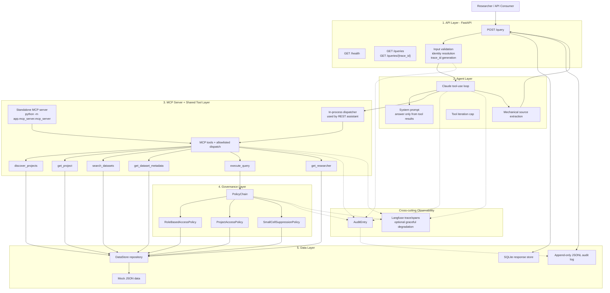
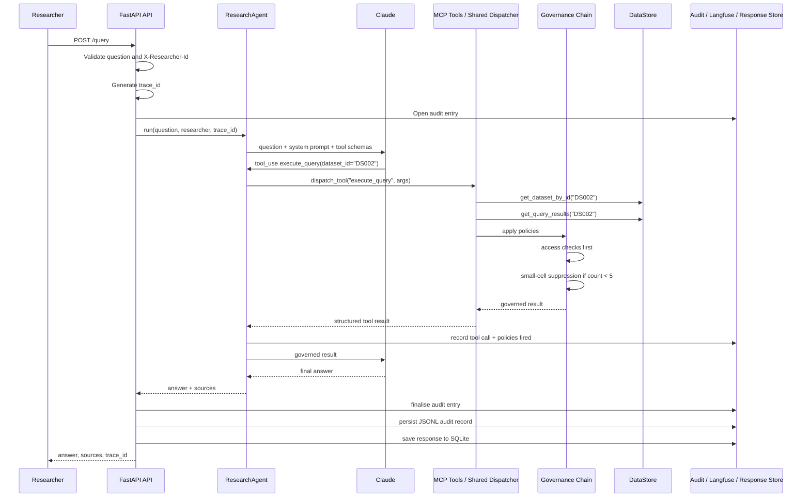

# NHS AI Research Assistant

A lightweight AI Research Assistant for a regional NHS Research and Analytics Platform.

Researchers ask natural language questions about approved research projects, available datasets, and permitted analytical queries. The assistant answers by using approved platform tools exposed through a lightweight MCP server and a shared in-process dispatcher, rather than directly accessing the underlying data. Every analytical result passes through a governance policy chain before it reaches the user, and every request is auditable end to end.

---

## Contents

- [NHS AI Research Assistant](#nhs-ai-research-assistant)
  - [Contents](#contents)
  - [System Summary](#system-summary)
  - [Architecture](#architecture)
    - [Architectural intent](#architectural-intent)
  - [Request Flow](#request-flow)
  - [Core Capabilities](#core-capabilities)
  - [MCP Tool Surface](#mcp-tool-surface)
  - [Governance and Safety](#governance-and-safety)
    - [Policy ordering](#policy-ordering)
    - [Small-cell suppression](#small-cell-suppression)
    - [Guardrails](#guardrails)
  - [Identity, Authorisation and RBAC](#identity-authorisation-and-rbac)
    - [Role-based access](#role-based-access)
    - [Project-level access](#project-level-access)
    - [Production authentication path](#production-authentication-path)
  - [Observability and Audit](#observability-and-audit)
    - [1. Audit log](#1-audit-log)
    - [2. Langfuse tracing](#2-langfuse-tracing)
  - [Response Persistence](#response-persistence)
  - [Why a Single Agent](#why-a-single-agent)
  - [Why Not an Agent Framework](#why-not-an-agent-framework)
  - [Why Not RAG](#why-not-rag)
    - [Scaling path](#scaling-path)
  - [Technology Choices](#technology-choices)
  - [Running Locally](#running-locally)
    - [1. Create a virtual environment](#1-create-a-virtual-environment)
    - [2. Install dependencies](#2-install-dependencies)
    - [3. Configure environment variables](#3-configure-environment-variables)
    - [4. Start the API](#4-start-the-api)
  - [Running the MCP Server](#running-the-mcp-server)
  - [Running with Docker](#running-with-docker)
  - [API Usage](#api-usage)
    - [Ask a question](#ask-a-question)
    - [Ask a question with researcher identity](#ask-a-question-with-researcher-identity)
    - [List recent responses](#list-recent-responses)
    - [Retrieve a response by trace ID](#retrieve-a-response-by-trace-id)
  - [Testing and Evaluation](#testing-and-evaluation)
  - [Latest Evaluation Result](#latest-evaluation-result)
  - [Project Structure](#project-structure)
  - [Assumptions](#assumptions)
  - [Known Limitations](#known-limitations)
  - [Future Improvements](#future-improvements)
  - [Assessment Design Notes](#assessment-design-notes)

---

## System Summary

The assistant follows a simple principle:

> The LLM may reason about what to do, but it cannot bypass platform tools, governance rules, or audit logging.

A researcher submits a natural language question to the API. The agent decides which approved tool to call, receives structured tool results, and then writes a grounded final answer. Analytical outputs are passed through a governance chain that enforces access control and small-cell suppression before the model can use them.

The response returned to the user always contains:

```json
{
  "answer": "A grounded answer based on governed tool results.",
  "sources": ["DS001", "PRJ003"],
  "trace_id": "uuid"
}
```

The `trace_id` is generated once per request and carried through the API, agent, MCP tools, governance layer, audit log, Langfuse trace, and response store.

---

## Architecture

The system is organised into five main layers, with observability and audit running across all of them.



### Architectural intent

Each layer has a clear responsibility:

| Layer                          | Responsibility                                                                         |
| ------------------------------ | -------------------------------------------------------------------------------------- |
| API layer                      | Request validation, researcher identity resolution, trace generation, response shaping |
| Agent layer                    | Tool selection, multi-step reasoning, final answer synthesis                           |
| MCP server + shared tool layer | Controlled access to platform capabilities through approved tool contracts             |
| Governance layer               | Enforced policy decisions before sensitive results reach the model or user             |
| Data layer                     | Repository access over mock data, audit persistence, response persistence              |
| Observability                  | Traceability across the full request lifecycle                                         |

The dependency direction is intentionally simple:

```text
app.main -> app.agent -> app.mcp_server -> app.governance -> app.datastore
```

The agent does not open files, query databases, or access raw data directly. It can only ask the MCP layer to perform approved operations.

The standalone MCP server and the REST assistant share the same underlying tool implementations. This avoids two versions of the same platform logic and keeps governance behaviour consistent across both execution paths.

---

## Request Flow

Example question:

```text
Run an analysis on DS002.
```

End-to-end flow through the REST API:



This flow ensures that data protection is not left to the LLM prompt. Governance is enforced in application code.

---

## Core Capabilities

The assistant can:

* Discover approved research projects.
* Retrieve project metadata.
* Search datasets by keyword, restriction status, and record count.
* Retrieve dataset metadata.
* Execute approved analytical queries against synthetic sample results.
* Apply governance controls before returning analytical outputs.
* Resolve researcher identity from the optional `X-Researcher-Id` header.
* Persist every response for later retrieval.
* Write an audit record for every request.
* Optionally send LLM traces and tool spans to Langfuse.

---

## MCP Tool Surface

The project exposes platform capabilities through a lightweight MCP server implemented with the Python MCP SDK. The REST assistant reuses the same underlying tool implementations through an in-process allowlisted dispatcher, so tool behaviour, governance enforcement, and error handling remain consistent across both execution paths.

The platform exposes six tools:

| Tool                   | Purpose                                                                      |
| ---------------------- | ---------------------------------------------------------------------------- |
| `discover_projects`    | Search or list approved research projects                                    |
| `get_project`          | Retrieve a specific project by ID                                            |
| `search_datasets`      | Search dataset metadata by keyword, restricted flag, or minimum record count |
| `get_dataset_metadata` | Retrieve metadata for a specific dataset                                     |
| `execute_query`        | Run an approved analytical query against a dataset                           |
| `get_researcher`       | Retrieve researcher details by username or role                              |

The standalone MCP server can be started with:

```bash
python -m app.mcp_server.mcp_server
```

The FastAPI assistant path does not call raw data directly. It calls the same approved tool functions through `dispatch_tool`, which keeps the system simple to run while preserving the MCP tool boundary required by the assessment.

All tool calls go through an allowlist. Unknown tools return structured errors rather than raising unhandled exceptions.

Tool arguments are validated at the boundary, and tool failures are returned in clean shapes such as:

```json
{
  "error": "Dataset not found"
}
```

This keeps the agent loop debuggable and prevents tool failures from crashing the API.

---

## Governance and Safety

Governance is implemented through a combination of explicit policy enforcement and wider application guardrails.

The policy chain handles decisions that depend on dataset, researcher, project, or analytical-result context. Wider guardrails protect the API, agent loop, tool boundary, output shaping, and audit trail.

```python
PolicyChain([
    RoleBasedAccessPolicy(),
    ProjectAccessPolicy(store),
    SmallCellSuppressionPolicy(threshold=5),
])
```

Policies are deliberately small, independent classes. Each policy implements:

```python
applies_to(context) -> bool
apply(result, context) -> result
```

Adding a new governance rule should require:

1. One new policy class.
2. One line registering it in the chain.
3. Unit tests for the new rule.

No agent, API, or tool-layer rewrite should be required.

### Policy ordering

Policy order matters.

Access decisions run first. Content protection runs last.

```text
RoleBasedAccessPolicy
        ↓
ProjectAccessPolicy
        ↓
SmallCellSuppressionPolicy
```

This means a denied request exits early before suppression logic runs. If a user is not allowed to analyse a dataset, there is no need to inspect or transform the analytical result.

### Small-cell suppression

The small-cell suppression policy protects analytical outputs where the record count is below the configured threshold.

Default threshold:

```text
5
```

If an `execute_query` result contains a count below the threshold, the result is replaced with a suppression message before returning to the agent.

This matters because the LLM never sees the unsafe detailed result. It only sees the governed result.

### Guardrails

Guardrails are enforced in code, not only in the prompt.

| Area            | Guardrail                                                         |
| --------------- | ----------------------------------------------------------------- |
| Input           | Non-empty question validation, maximum question length            |
| Identity        | Optional researcher header is validated against known researchers |
| Tool use        | Tool allowlist prevents arbitrary tool invocation                 |
| Tool arguments  | Pydantic validation at tool boundaries                            |
| Agent loop      | Maximum tool iteration cap                                        |
| Model behaviour | Temperature 0 for deterministic responses                         |
| Output          | Sources extracted mechanically from tool results                  |
| Governance      | Policy chain has final say before results reach the model         |
| Audit           | Every request receives a traceable audit record                   |

Prompt injection is treated as a real risk. A malicious question may try to convince the model to ignore rules, but the model cannot bypass the allowlist, cannot access data directly, and cannot override the governance policy chain.

---

## Identity, Authorisation and RBAC

This project distinguishes between authentication and authorisation.

Authentication proves who a user is. That is not implemented here.

Authorisation decides what a known user is allowed to do. That is implemented through the governance layer.

For this assessment, identity is asserted using an optional request header:

```http
X-Researcher-Id: alice
```

If the header is present, the API validates the username against `researchers.json` and passes the researcher context into the agent and governance layer.

If the header is absent, the assistant still works in demo mode. This allows the original evaluation questions to run without authentication.

If the header contains an unknown researcher, the API returns a clear `400` response.

### Role-based access

`RoleBasedAccessPolicy` applies to analytical queries.

Administrators may analyse restricted datasets. Standard researchers may not analyse restricted datasets unless a future policy allows it.

### Project-level access

`ProjectAccessPolicy` applies resource-level authorisation.

A researcher may only run analysis on datasets linked to projects they are assigned to. Administrators bypass this check.

This models a real TRE-style access pattern: users may be known to the platform, but that does not mean they can analyse every dataset.

### Production authentication path

In production, the `X-Researcher-Id` header would be replaced with real authentication, such as Keycloak or NHS OIDC.

The governance layer would not need to change, because policies consume an identity context object rather than relying on the transport mechanism.

---

## Observability and Audit

Observability is two-layered.

### 1. Audit log

The audit log is the platform’s compliance record.

It is always on and has no external dependency.

Audit entries are written to:

```text
logs/audit.jsonl
```

Each line contains one request record, including:

```json
{
  "trace_id": "uuid",
  "timestamp": "2026-07-08T10:15:00+00:00",
  "question": "Run an analysis on DS002",
  "researcher": "alice",
  "tool_calls": [
    {
      "tool": "execute_query",
      "args": {
        "dataset_id": "DS002"
      },
      "duration_ms": 4,
      "policies_fired": ["SmallCellSuppressionPolicy"]
    }
  ],
  "total_duration_ms": 1240,
  "errors": [],
  "answer_preview": "The result has been suppressed..."
}
```

JSONL was chosen because it is append-only, simple to inspect, and resilient to partial writes compared with repeatedly rewriting a JSON array.

### 2. Langfuse tracing

Langfuse provides LLM-level observability for engineering teams.

When configured, the app records:

* One trace per request.
* Spans for tool calls.
* Shared `trace_id` correlation with the audit log.
* Model-level timing and tracing metadata where available.

Langfuse is optional. If Langfuse keys are not configured, tracing is skipped and the application continues to run normally.

This graceful degradation is important for local development, automated tests, and secure environments where external observability services may not be available.

---

## Response Persistence

In addition to the audit log, the system stores user-facing responses in SQLite.

Database file:

```text
responses.db
```

The response store is separate from the audit log.

| Store                 | Purpose                                    | Audience                |
| --------------------- | ------------------------------------------ | ----------------------- |
| Audit JSONL           | Compliance, debugging, policy traceability | Operators and engineers |
| SQLite response store | Retrieval of past question/answer pairs    | Users and API consumers |

Response history is available through:

```http
GET /queries
GET /queries/{trace_id}
```

Each saved response includes:

* Trace ID
* Original question
* Final answer
* Sources
* Researcher ID, if supplied
* Timestamp

---

## Why a Single Agent

This project uses one agent.

That decision is intentional.

The assessment questions are single-intent and usually require one to three sequential tool calls. A single Claude tool-use loop is easier to inspect, test, and audit than a multi-agent system.

A multi-agent architecture was considered, such as:

* Router agent
* Projects agent
* Dataset agent
* Analysis agent

That design was not used for this assessment because it would add latency, orchestration complexity, and more failure modes without improving the outcome.

The decision rule is:

> Agent count should follow workload complexity, not ambition.

The governance and audit layers are agent-count agnostic, so the system could move to multiple specialised agents later without reworking the safety model.

---

## Why Not an Agent Framework

Agent frameworks such as LangChain were considered but deliberately not used.

The goal of this implementation is to make the tool-use loop, tool dispatch, source extraction, policy enforcement, and audit trail easy to inspect. Hiding those behaviours behind a framework would make the system harder to reason about and harder to defend technically.

The implementation uses direct provider APIs and a small explicit agent loop instead. Every model call, tool call, policy decision, and source extraction step is visible in application code.

In a Trusted Research Environment, fewer opaque layers means easier assurance. The system favours explicit control flow over framework convenience because every decision should be traceable and explainable.

The code still keeps a provider abstraction, so the design is not locked to a single LLM vendor. Additional providers can be added behind the same interface without introducing a full agent framework.

---

## Why Not RAG

RAG was considered and deliberately not used for the current platform data.

The data in this assessment is small, structured, and exact:

* Project IDs
* Dataset IDs
* Dataset metadata
* Researcher records
* Pre-canned sample query results

For this kind of data, direct tool-based retrieval is more accurate than chunking and embedding records into a vector store.

Chunking structured records would replace exact lookups with approximate semantic retrieval. That would make the system less reliable and harder to audit.

### Scaling path

The system has a staged scaling path:

| Stage                     | Approach                                                              |
| ------------------------- | --------------------------------------------------------------------- |
| Current                   | In-memory indexed repository over JSON files                          |
| Structured growth         | Replace repository internals with Postgres and indexed search         |
| Larger metadata catalogue | Add semantic search over dataset names and descriptions               |
| Unstructured documents    | Add full RAG for protocols, ethics documents, and clinical guidelines |

---

## Technology Choices

| Choice                         | Reason                                                                                                          |
| ------------------------------ | --------------------------------------------------------------------------------------------------------------- |
| Python                         | Strong fit for AI engineering and data workflows                                                                |
| FastAPI                        | Lightweight API framework with automatic OpenAPI docs                                                           |
| Anthropic Claude               | Native tool use and controllable agent loop                                                                     |
| MCP server + shared tool layer | Exposes backend capabilities through MCP tools while reusing one governed implementation for the REST assistant |
| Pydantic                       | Request and tool argument validation                                                                            |
| SQLite                         | Simple persistent response history for the assessment scope                                                     |
| JSONL audit log                | Append-only, inspectable compliance record                                                                      |
| Langfuse                       | LLM observability and trace correlation                                                          |
| pytest                         | Unit testing for repository, tools, and governance                                                              |
| Docker                         | Reproducible local/container execution                                                                          |

---

## Running Locally

This project was built and containerised with Python 3.12.

### 1. Create a virtual environment

```bash
python3 -m venv .venv
source .venv/bin/activate
```

### 2. Install dependencies

```bash
python3 -m pip install -r requirements.txt
```

### 3. Configure environment variables

```bash
cp .env.example .env
```

Then add your Anthropic API key:

```env
ANTHROPIC_API_KEY=your_key_here
```

Optional provider and Langfuse variables:

```env
OPENAI_API_KEY=
LANGFUSE_PUBLIC_KEY=
LANGFUSE_SECRET_KEY=
LANGFUSE_HOST=https://cloud.langfuse.com
```

### 4. Start the API

```bash
uvicorn app.main:app --reload
```

The API will be available at:

```text
http://localhost:8000
```

Interactive API docs:

```text
http://localhost:8000/docs
```

---

## Running the MCP Server

The project includes a standalone MCP server entrypoint exposing the approved research platform tools.

```bash
python -m app.mcp_server.mcp_server
```

The MCP server reuses the same underlying tool functions as the REST assistant. This keeps the implementation small while preserving one source of truth for project discovery, dataset search, metadata lookup, researcher lookup, analytical query execution, and governance enforcement.

---

## Running with Docker

```bash
cp .env.example .env
docker compose up --build
```

Health check:

```bash
curl http://localhost:8000/health
```

Expected response:

```json
{
  "status": "ok"
}
```

The Docker entrypoint uses:

```bash
uvicorn app.main:app --host 0.0.0.0 --port 8000
```

This works with the package-based layout because `app/main/__init__.py` re-exports the FastAPI `app` instance from `app/main/main.py`.

---

## API Usage

### Ask a question

```bash
curl -X POST http://localhost:8000/query \
  -H "Content-Type: application/json" \
  -d '{"question": "Which datasets are available for diabetes research?"}'
```

### Ask a question with researcher identity

```bash
curl -X POST http://localhost:8000/query \
  -H "Content-Type: application/json" \
  -H "X-Researcher-Id: alice" \
  -d '{"question": "Run an analysis on DS005."}'
```

### List recent responses

```bash
curl http://localhost:8000/queries
```

### Retrieve a response by trace ID

```bash
curl http://localhost:8000/queries/{trace_id}
```

---

## Testing and Evaluation

Run unit tests:

```bash
python3 -m pytest tests/ -v
```

Run the evaluation harness:

```bash
python3 run_evals.py
```

The evaluation harness expects the app to be running locally on port `8000`.

```bash
uvicorn app.main:app --reload
python3 run_evals.py
```

The evaluation file covers project discovery, dataset search, metadata lookup, researcher lookup, and governed analytical queries.

The intended validation strategy is:

1. Unit tests for repository lookups and filters.
2. Unit tests for governance policies.
3. Tool tests for clean error shapes and validation.
4. Evaluation run across all supplied assessment questions.
5. Repeat evaluation runs to check answer stability.

---

## Latest Evaluation Result

The evaluation harness was run against the local FastAPI app using the supplied evaluation questions in `mock-data/evaluation_questions.json`.

```bash
uvicorn app.main:app --reload
python3 run_evals.py
```

Latest result:

```text
25/25 returned 200 OK
```

This confirms that the assistant can handle the supplied project, dataset, researcher, and analytical-query questions end to end through the API, agent, MCP tool layer, governance chain, and response shaping.

---

## Project Structure

```text
.
├── app
│   ├── __init__.py
│   ├── agent
│   │   ├── __init__.py
│   │   └── agent.py              # Claude/OpenAI provider seam and research agent loop
│   ├── audit
│   │   ├── __init__.py
│   │   └── audit.py              # Audit entry model and JSONL persistence
│   ├── config
│   │   ├── __init__.py
│   │   └── config.py             # Environment loading and app settings
│   ├── datastore
│   │   ├── __init__.py
│   │   └── data_store.py         # Repository over mock JSON data
│   ├── governance
│   │   ├── __init__.py
│   │   └── governance.py         # Policy chain and governance policies
│   ├── main
│   │   ├── __init__.py
│   │   └── main.py               # FastAPI application and routes
│   ├── mcp_server
│   │   ├── __init__.py
│   │   └── mcp_server.py         # MCP server, tool implementations, and dispatch allowlist
│   ├── observability
│   │   ├── __init__.py
│   │   └── observability.py      # Optional Langfuse integration
│   ├── response_store
│   │   ├── __init__.py
│   │   └── response_store.py     # SQLite response persistence
│   ├── sys_prompt
│   │   ├── __init__.py
│   │   └── sys_prompt.py         # System prompt construction
│   └── tool_schemas
│       ├── __init__.py
│       └── tool_schemas.py       # Claude/MCP-style tool schema definitions
├── mock-data
│   └── evaluation_questions.json # Supplied evaluation questions
├── tests
│   ├── test_data_store.py
│   └── test_governance.py
├── logs                         # Runtime audit logs, ignored by git
├── run_evals.py                 # Evaluation harness
├── Dockerfile
├── docker-compose.yml
├── requirements.txt
├── .env.example
├── .gitignore
└── README.md
```

---

## Assumptions

1. Synthetic data is trusted input, with light validation at ingestion.
2. The project implements authorisation, not production authentication.
3. `X-Researcher-Id` is an asserted identity for demonstration.
4. `execute_query` returns pre-canned sample results rather than running a real query engine.
5. Small-cell suppression threshold is `5`.
6. Sources are IDs of projects, datasets, or researchers returned by tools.
7. Restricted datasets may be discovered, but analysis is governed.
8. The current JSON-backed repository is sufficient for the supplied assessment data.
9. The standalone MCP server and REST assistant share the same tool implementations to avoid duplicate governance and data-access logic.

---

## Known Limitations

* Authentication is not implemented; identity is asserted through a request header.
* The audit log and SQLite response store are suitable for a single-instance assessment app, not horizontally scaled production.
* Dataset and project search use simple case-insensitive matching.
* The evaluation harness currently checks response success and answer previews; a production-grade evaluator would add semantic assertions for expected content.
* The OpenAI provider seam is architectural rather than a fully tested second provider.
* The standalone MCP server is lightweight and uses the same in-process tool implementations as the REST assistant; a production deployment would run the MCP server as a separately managed service.
* No external literature retrieval is implemented.

---

## Future Improvements

Potential production improvements include:

* Replace header-based identity assertion with real authentication through Keycloak or NHS OIDC.
* Move audit and response persistence to a production database.
* Add distributed tracing and centralised log aggregation.
* Add Kubernetes deployment manifests and production health checks.
* Add a proper staging deployment and CI/CD pipeline.
* Run the MCP server as a separately deployed service with managed lifecycle, service discovery, and transport-level controls.
* Add semantic search over dataset metadata if the catalogue grows.
* Add full RAG only when unstructured documents enter the platform.
* Add TRE-aware literature retrieval through an approved egress route or internally mirrored research index.
* Add discovery-level restricted dataset notices separate from analysis-level blocking.
* Extend automated evaluation to assert expected answer content, not just successful responses.

---

## Assessment Design Notes

This repository is intentionally small but structured. The aim is to demonstrate:

* Safe tool-using agent design.
* Clear separation between reasoning, tools, governance, and data.
* Extensible policy enforcement.
* Auditability.
* Deterministic, explainable behaviour.
* Practical awareness of NHS/TRE constraints.
* A codebase that can be defended line by line in a technical interview.

For a live extension task, the safest change path is: add or update the repository method, expose it through one tool, apply governance if sensitive data is returned, then add a focused unit test and evaluation question.
